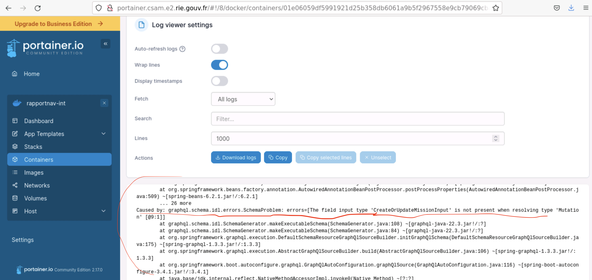
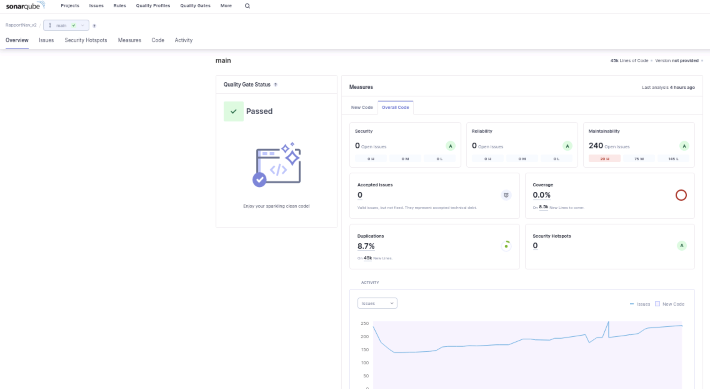

# Monitoring

## Sentry

Sentry est mis à disposition via l'incubateur de la Fabrique Numérique.

Il est notre principale source de suivi des erreurs.

## Portainer

Portainer permet de visualiser les logs et autres stats pour différents containers, images Docker.

Pour l'instant, il faut demander à chaque fois l'accès à la DSI car les droits sont overwritten à chaque déploiement.

Portainer n'est accessible que via le RIE à l'url suivante: http://int-rapportnav-appli01.dsi.damgm.i2

Les logs du backend et de la database sont visibles dans les logs du container

## Sonarqube

Sonarqube permet de mesurer la qualité du code selon plusieurs critères comme la couverture de tests, duplication de code, code smells, maintenabilité...

A chaque push sur main sur le Gitlab de la DSI, une analyse est lancée et les résultats sont updatés automatiquement.

Il est possible de voir le projet en suivant l'url: http://sonarqube.dsi.damgm.i2/projects

En fonction du résultat de la Quality Gate, un déploiement peut être bloqué.

