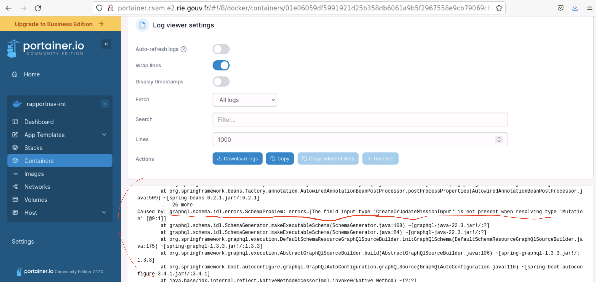

# Troubleshooting

## J'ai déployé mais l'appli ne se lance pas

**Symptome**: après un déploiement, en se rendant sur RapportNav, rien ne se lance, rien n'est affiché.

**Cause**: l'appli a été buildée et containerizée mais la commande pour lancer le backend fail.

**Que faire**:
- Envoyer un mail à la DSI pour avoir accès à Portainer en leur précisant l'environnement et la version de l'appli (refaire pour chaque déploiement, ce n'est pas automatique pour l'instant)
- Une fois l'accès à portainer, sélectionnez:
  - l'environnement
  - puis le container backend
  - enfin, investiguez les logs

