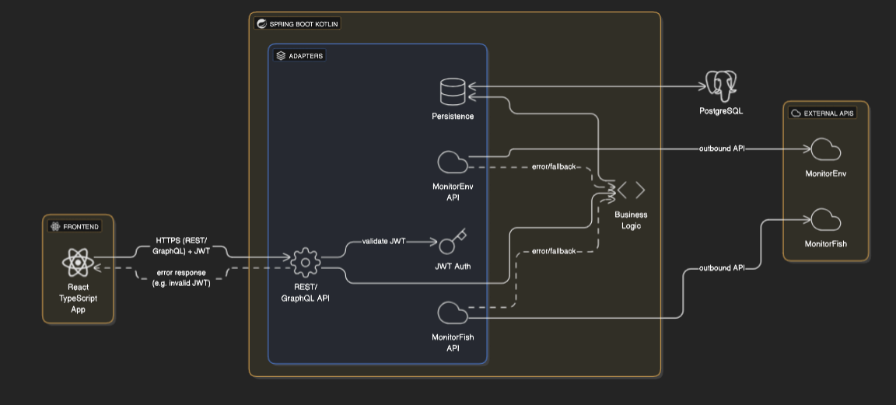
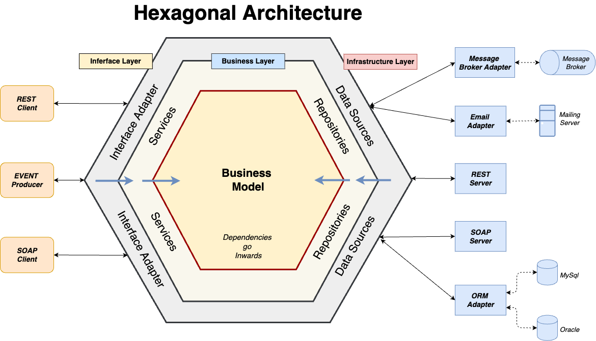

# Backend

## Stack

Le backend utilise les outils suivants :
- kotlin comme langage
- spring-boot comme framework
- gradle comme build tool

## Architecture

Le diagramme suivant représente l'architecture de RapportNav

### Clean Architecture

Le pattern d'architecture utilisé est commun entre RapportNav et les Monitor, il s'agit de clean architecture dans sa variante hexagonale.

Le diagramme suivant est une bonne explication, bien que plus complet que la réalité de RapportNav.

La clean architecture permet de compartimenter les différents layers applicatifs (domain, data sources, data storage, APIs...) qui ont des mappers pour passer d'un niveau à un autre.
Ainsi, toute la logique métier est basée sur ses propres définitions.
Cela permet d'éviter par ex de devoir changer la logique métier alors qu'une API externe a changé.

Ceci dit, ce pattern vient avec un coût et une certaine lourdeur d'utilisation mais sur le long-terme, il nous permet d'éviter bien des soucis.

### Convention des Layers et Entités

#### Domain

Situé dans le dossier `domain/`, c'est le coeur de la logique business/métier.

On y trouvera:
- la définition des Entités
- des méthodes `use-cases` où la logique métier est implémentée
- des repositories afin d'accéder à des méthodes d'autres layers (storage)

#### Infrastructure

Situé dans `infrastructure/`, on y trouvera les layers de :
- stockage
- data sources
- API externes
- cache

##### Storage

Situé dans `infrastructure/database`, c'est à cet endroit grâce à JPA que les méthodes de lecture/écriture dans la database seront effectués.

##### Data sources

On trouvera ici autant de dossiers que de data sources comme :
- `monitorfish/` pour accéder aux APIs MonitorFish
- `monitorenv/` pour accéder aux APIs MonitorEnv

##### APIs

Dans `api/` seront listées ici toutes les APIs externe que RapportNav met à disposition.

##### cache

Dans `cache/` sera configuré la gestion des différents caches.
Un cache a été mis en place pour réduire les intéractions avec les Monitors.
La technologie de cache est `caffeine`

On distingue 2 types de caches:
- longue durée, invalidé une fois par server restart car ces données sont très statiques:
  - NATINFs
  - ControlPlans (thématiques de contrôles/surveillances)
- très courtes durées, de l'ordre de quelques minutes, généralement pour économiser de la bandwidth pour:
  - Missions Env
  - Actions Env
  - Actions Fish

#### Convention de nommage

La convention de nommage d'une entités `xxx` sera:
- `xxxEntity` pour le domain layer
- `xxxModel` pour le database layer
- `xxx` pour l'API

