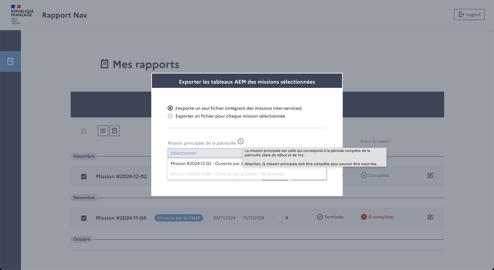
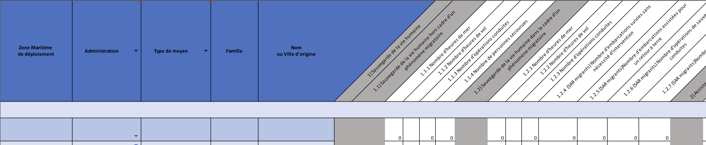
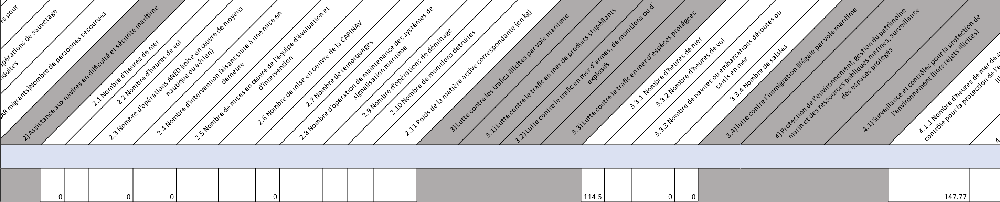
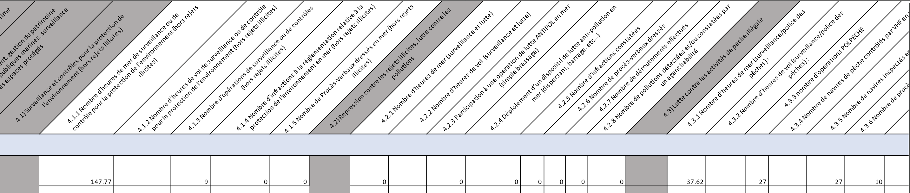
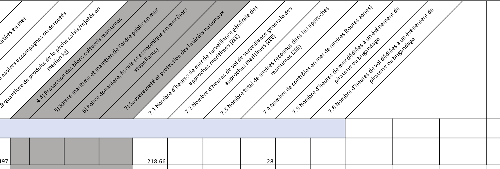

# Tableaux AEM

## Description

AEM = Action de l'Etat en Mer

Dans leur process, les PAM et ULAM doivent compléter un template de tableau AEM et l'envoyer à leur hiérarchie.

Ce tableau était écrit à la main par les commandants et était une tâche très fastidieuse.
Il leur est désormais disponible d'exporter ce tableau quand leur mission est **terminée** et **complétée**.

Il est possible de combiner plusieurs missions en 1 seul tableau après avoir précisé la mission principale.

Il est aussi possible d'exporter selon des plages de dates différentes : à la mission, à la jouréem au mois...

## Lancer l'export

Une fois la mission **terminée** et **complétée**, les utilisateurs peuvent se rendre sur la page d'accueil et profiter des différentes options d'export.
Il leur est possible d'exporter :
- un tableau pour une seule mission
- un tableau avec plusieurs missions combinées dans une mission principale (très courant pour missions inter-services)
- un zip avec un tableau par mission

Dans le cas des missions combinées en une seule, ce n'est pas grave si les missions secondaires sont incompletes car on veut juste récupérer les actions.
Dans le cas du zip avec un tableau par mission, les missions incomplètes ne seront pas exportées.

## Contenu

Ces tableaux ont un couverture plus large que le rayon d'action des unités du DCS, il y a donc des sections qui n'ont pas vocation à être remplies.

Les sections qui nous intéressent sont :
- #1 - Sauvegarde de la vie humaine
- #2 - Assistance aux navires en difficulté et sécurité maritime
- #3.3 - Lutte contre le trafic en mer d’espèces protégées
- #4 - Protection de l’environnement, gestion du patrimoine marin et des ressources publiques marines, surveillance des espaces protégés 
- #7 - Souveraineté et protection des intérêts nationaux

