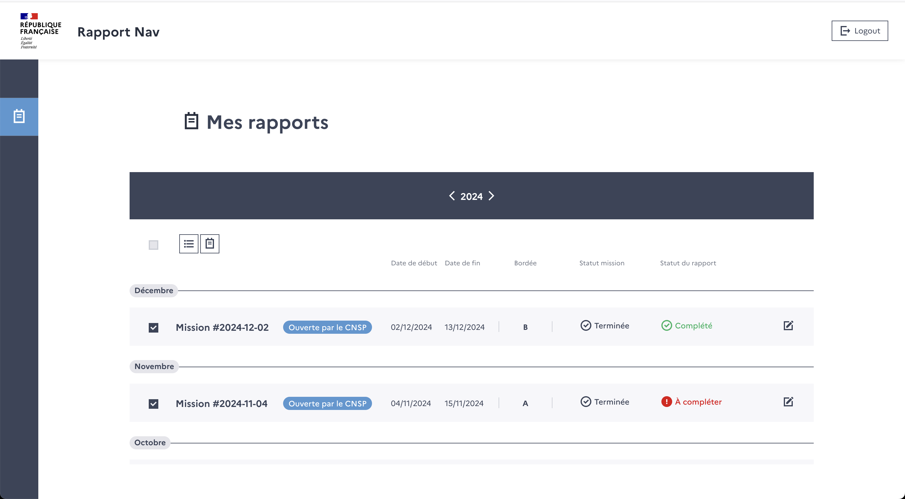

# Compléter un rapport

Afin de compléter leur rapports de mission, les unités ont accès à 2 pages pour :
- lister toutes leurs missions
- éditer un rapport

## Liste de missions

:a première page permet de lister les missions par patrouiller dans le cas des PAM, par centre pour les ULAM.

Il leur est aussi permis d'exporter divers rapports.

### Diƒférences entre PAM et ULAM

Bien que similaire dans l'esprit, il existe des divergences entre la version PAM et ULAM :
- les rapports sont affichés a l'année pour PAM, au mois pour ULAM
- ULAM a la possibilité d'exporter les tableaux AEM au mois
- les cellules de la liste n'affichent pas les mêmes informations

## Éditer un rapport

En cliquant sur une mission, il est possible de la modifier.

Cette page contient 3 colonnes et pour faire simple :
- colonne de gauche : informations sur la mission (dates, équipages, moyens, conso, observations...)
- colonne du centre: chronologie des actions + ajout d'actions
- colonne de droite : détails d'une mission avec divers formulaires

