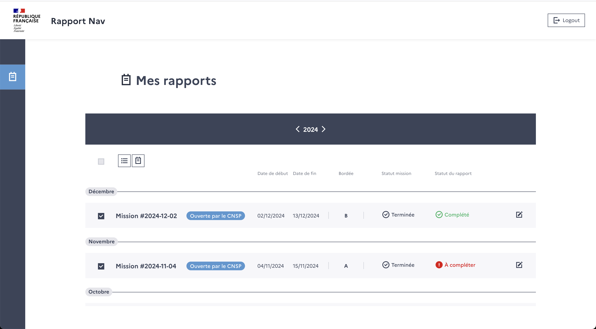
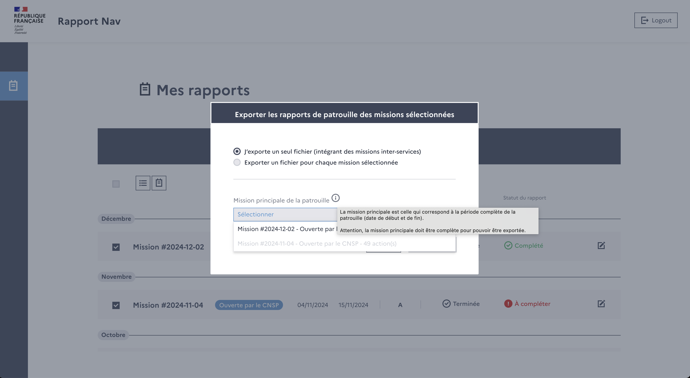
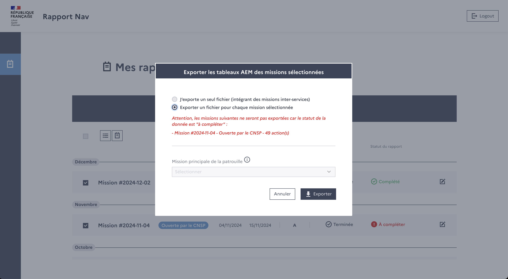
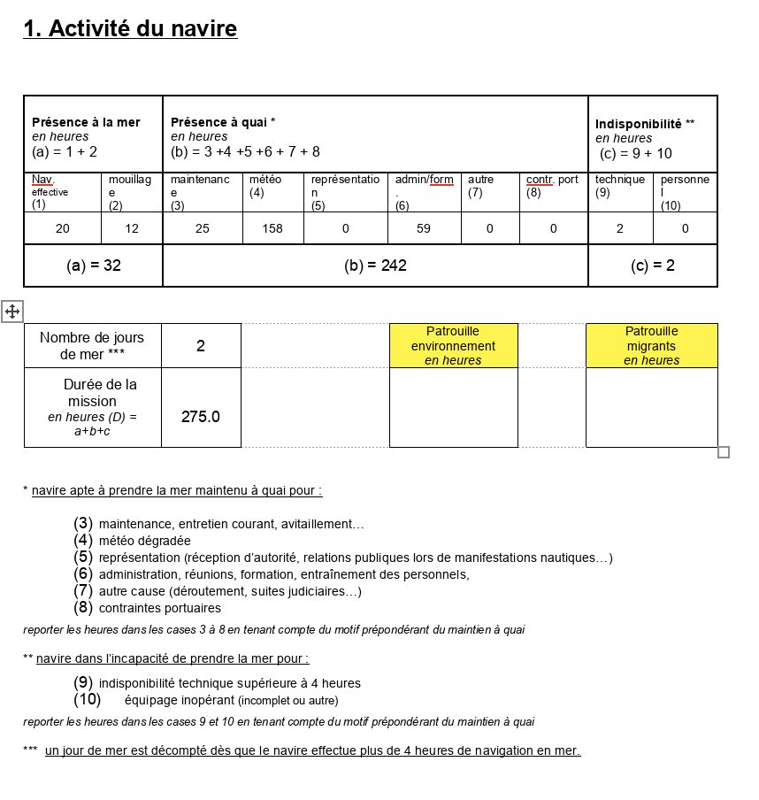
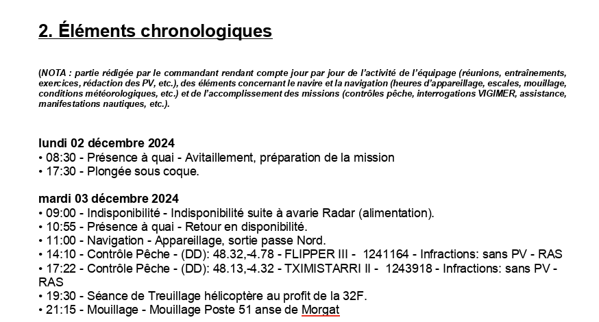
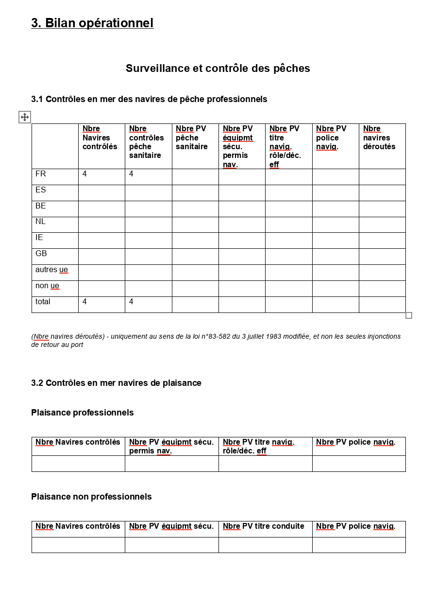
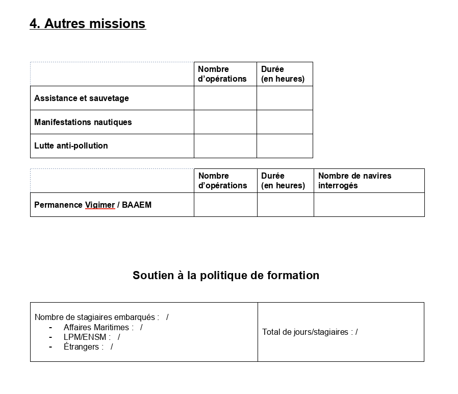
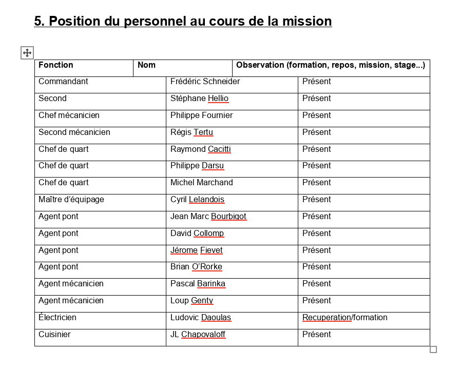

# Rapport de patrouille (PAM)

## Description

Dans leur process, les PAM doivent écrire et envoyer un rapport de patrouille à leur hiérarchie.

Ce rapport était écrit à la main par les commandants et était une tâche très fastidieuse.
Il leur est désormais disponible d'exporter ce tableau quand leur mission est **terminée** et **complétée**.

Il est possible de combiner plusieurs missions en 1 seul rapport après avoir précisé la mission principale.

## Lancer l'export

Une fois la mission **terminée** et **complétée**, les utilisateurs peuvent se rendre sur la page d'accueil et profiter des différentes options d'export.
Il leur est possible d'exporter :
- un rapport pour une seule mission
- un rapport avec plusieurs missions combinées dans une mission principale (très courant pour missions inter-services)
- un zip avec un rapport par mission

Dans le cas des missions combinées en une seule, ce n'est pas grave si les missions secondaires sont incompletes car on veut juste récupérer les actions.
Dans le cas du zip avec un rapport par mission, les missions incomplètes ne seront pas exportées.

## Contenu

### Activité du navire

La première section du rapport concerne l'activité du navire, qui permet d'avoir une vision de la répartition du temps entre différentes tâches.

Le premier tableau est calculé grâce aux actions de statut, d'où l'importance pour les utilisateurs de bien renseigner leur statuts tout au long de la mission.

D'autres données sont ensuite affichées :
- le nombre d'heures en patrouille environnement (calculé grâce aux actions Env)
- le nombre d'heures en patrouille migrants (calculé grâce aux action Nav immigration illégale)
- la distance parcourue et la consomation en carburant
- des observations générales sur la mission

### Chronologie

La même chronologie que sur l'interface est affichée dans le rapport de patrouille.
Il s'agit de lister toutes les actions entre le début et la fin de la mission, organisées par jour.

Il est possible pour les commandants de venir étoffer cette chronologie si nécessaire.

### Bilan opérationnel

Grâce aux différentes actions renseignées dans l'interface entre RapportNav et MonitorFish/Env, d'autres tableaux sont générés :
- Contrôles en mer des navires de pêche professionnels
- Contrôles en mer navires de plaisance
- Contrôles à terre - navires au débarquement, à quai
- Contrôles environnement marin

### Autres missions

Ensuite sont renseignées plusieurs indicateurs à propos de certains types d'actions telles que :
- assistance et sauvetage
- manifestations nautiques
- lutte anti-pollution
- permanence Vigimer/BAAEM
- soutien à la politique de formation des agents de l'état

### Equipage

Similairement à l'interface, les commandants ont l'obligation de mentionner quels membres de l'équipage ont été présents/absents.

### Rapport chef mécanicien

Le rapport du chef mécanicien est attaché au rapport de patrouille par le commandant.

Ce rapport n'utilise aucune des données collectée par RapportNav, il n'est donc pas généré.
